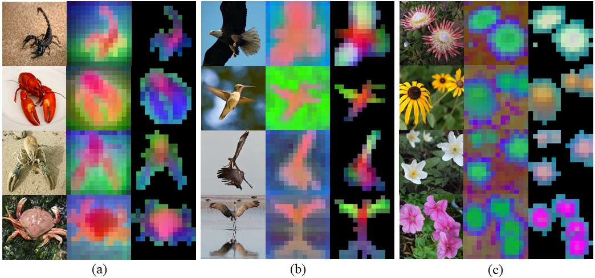
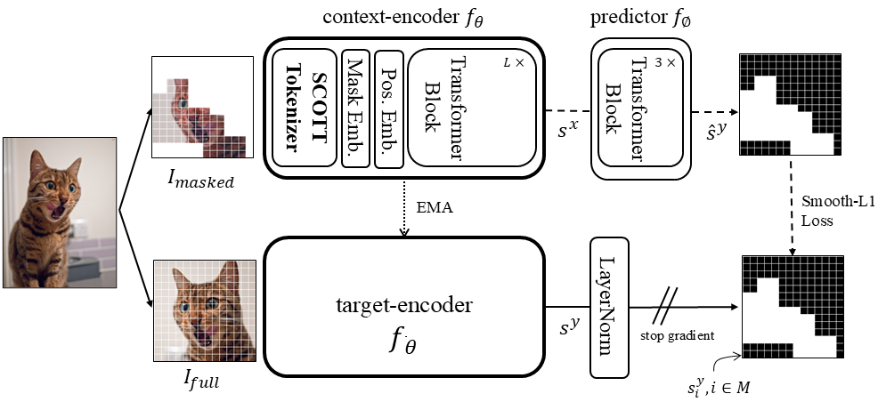

# __Escaping the Big Data Paradigm in Self-Supervised Representation Learning__

[[Paper]]() by [Carlos Vélez García](https://github.com/cvg25), Miguel Cazorla and Jorge Pomares.


<em style="text-align: justify">**Matching different semantic parts across categories and poses**. We show the first 3 components of a PCA computed among the token embeddings of images from the same column (a, b, and c). The background is removed by thresholding the first component. Notably, semantically similar parts are matched by color despite belonging to different object classes and poses. For instance: in (a) animal claws are purple and torso pink, in (b) wings are green and torso red. Interestingly, once background is removed in (c), different flower disks are matched to different colors.</em>

## Abstract
The reliance on large-scale datasets and extensive computational resources has become a significant barrier to advancing representation learning from images, particularly in domains where data is scarce or expensive to obtain. In this paper, we address the critical question: _Can we escape the big data paradigm in self-supervised representation learning from images?_ We introduce **SCOTT** (**S**parse **Co**nvolutional **T**okenizer for **T**ransformers), a shallow tokenization architecture that is compatible with Masked Image Modeling (MIM) tasks. SCOTT injects convolutional inductive biases into Vision Transformers (ViTs), enhancing their efficacy in small-scale data regimens. Alongside, we propose to train on a Joint-Embedding Predictive Architecture within a MIM framework (**MIM-JEPA**), operating in latent representation space to capture more semantic features. Our approach enables ViTs to be trained from scratch on datasets orders of magnitude smaller than traditionally required --without relying on massive external datasets for pretraining. We validate our method on three small-size, standard-resoultion, fine-grained datasets: Oxford Flowers-102, Oxford IIIT Pets-37, and ImageNet-100. Despite the challenges of limited data and high intra-class similarity of these datasets, our frozen SCOTT models pretrained with MIM-JEPA significantly outperform fully supervised methods and achieve competitive results with state-of-the-art approaches that rely on large-scale pretraining, complex image augmentations and bigger model sizes. By demonstrating that robust off-the-shelf representations can be learned with limited data, compute, and model sizes, our work paves the way for computer applications in resource constrained environments such as medical imaging or robotics. Our findings challenge the prevailing notion that vast amounts of data are indispensable for effective representation learning in vision, offering a new pathway toward more accessible and inclusive advancements in the field.

## Method


An image $$I_{full}$$ is processed by the target-encoder $$f_{\bar{\theta}}$$ to produce a latent patch-level representation $$s^y$$, whose masked patches $$M$$ are used as targets; The context image $$I_{masked}$$, generated from the complement of $$M$$, is input to the context-encoder $$f_{\theta}$$ to produce $$s^x$$. The predictor $$f_\phi$$ is fed with $$s^x$$ to predict the missing content $$\hat s^y$$. The Smooth-L1 loss is computed only on the (black) masked patches in latent space to update the context-encoder and predictor weights (dashed line), while the target encoder's weights are updated via an exponential moving average (EMA) of the context-encoder (dotted line).

- **SCOTT**: a sparse convolutional tokenizer for vision transformers that incorporates CNN-like inductive biases within ViTs and is compatible with Masked Image Modeling (MIM) training due to its sparse architecture.

- **MIM-JEPA**: operating in latent representation space where pixel-level details are potentially eliminated, improves learning efficiency and leads to the extraction of more semantically meaningful features.

## Requirements

- Python 3.10
- PyTorch
- torchvision
- Other dependencies: pyyaml, numpy, opencv, einops, wandb, einops, tqdm.

## Getting started

**Execute training**. First adapt the config file and then execute:
```
$ python main.py --config_file ./configs/ssl/scott.yaml
```
**Execute frozen probe evaluations**. Adapt the config file and then execute:
```
$ python main.py --config_file ./configs/eval/classifier.yaml
```

## Citation

```
@article{velezgarcia2025escapingbigdatassl,
         title={Escaping the Big Data Paradigm in Self-Supervised Representation Learning}, 
         author={Carlos Vélez-García and Miguel Cazorla and Jorge Pomares},
         year={2025},
         eprint={},
         archivePrefix={arXiv},
         primaryClass={cs.CV},
         url={}, 
}
```
